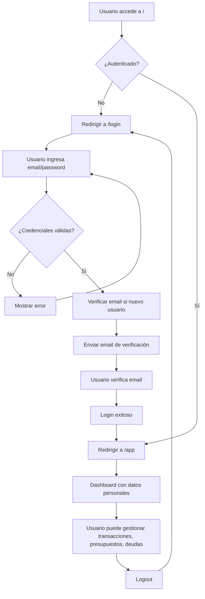

# Arquitectura de Autenticación y Multi-Usuario para Aplicación Next.js con Firebase

## 1. Análisis de la Estructura Actual del Proyecto

### Configuración de Firebase
- **Archivo**: `src/lib/firebase.ts`
- **Estado actual**: Solo inicializa Firestore. No incluye Firebase Auth.
- **Configuración**: Usa variables de entorno para API keys, pero falta configuración de Auth.

### Tipos de Datos
- **Archivo**: `src/lib/types.ts`
- **Estado actual**: Define tipos para `Transaction`, `Category`, `Budget`, `Debt`, `DebtPayment`, `DebtGoal`.
- **Problema**: Ningún tipo incluye `userId`, lo que permite acceso global a datos.

### Hooks de Firestore
- **Archivo**: `src/hooks/use-firestore.ts`
- **Estado actual**: Proporciona hooks para todas las colecciones (transactions, categories, budgets, debts, etc.).
- **Problema**: Todas las consultas son globales sin filtrado por usuario. Ejemplo:
  ```typescript
  const q = query(collection(db, 'transactions'), orderBy('date', 'desc'));
  ```
- **Colecciones actuales**: `transactions`, `categories`, `budgets`, `debts`, `debt_payments`, `debt_goals`.

### Componentes Principales
- **Página principal**: `src/app/page.tsx` - Dashboard que consume hooks de Firestore sin autenticación.
- **Componentes de dashboard**: Como `src/components/dashboard/summary-cards.tsx` - Muestran datos globales.
- **Estado actual**: Toda la aplicación funciona sin usuarios; datos compartidos globalmente.

## 2. Diseño de Autenticación

### Firebase Auth Integration
- **Métodos de autenticación**: Email y contraseña (con verificación de email).
- **Funcionalidades**: Login, signup, logout, gestión de sesiones.

### Integración con Next.js
- **Middleware**: Proteger rutas bajo `/app` redirigiendo usuarios no autenticados a `/login`.
- **Auth Context Provider**: `AuthProvider` para estado global de autenticación.
- **Hook personalizado**: `useAuth` para acceder al estado de usuario en componentes.

### Componentes de Autenticación
- **LoginForm**: Formulario de inicio de sesión.
- **SignupForm**: Formulario de registro con validación.
- **ProtectedRoute**: Wrapper para rutas protegidas.

### Gestión de Sesiones
- **onAuthStateChanged**: Listener para cambios en el estado de autenticación.
- **Persistencia**: Usar `browserSessionPersistence` para mantener sesión activa.

## 3. Diseño de Multi-Usuario

### Estructura de Base de Datos Firestore
- **Enfoque**: Añadir `userId` como campo obligatorio en todos los documentos.
- **Colecciones por usuario**: Mantener colecciones globales pero filtrar por `userId`.
- **Ejemplo de estructura**:
  ```
  /transactions/{docId}
    - userId: string
    - type: 'income' | 'expense'
    - amount: number
    - date: string
    - category: string
    - ...

  /categories/{docId}
    - userId: string
    - name: string
    - icon: string
    - type: 'income' | 'expense'

  /budgets/{docId}
    - userId: string
    - category: string
    - amount: number

  /debts/{docId}
    - userId: string
    - tipo: DebtType
    - monto: number
    - ...

  /debt_payments/{docId}
    - userId: string
    - debt_id: string
    - amount: number
    - ...

  /debt_goals/{docId}
    - userId: string
    - debt_id: string
    - target_amount: number
    - ...
  ```

### Actualización de Tipos
- Añadir `userId: string` a todos los tipos existentes.
- Ejemplo:
  ```typescript
  export type Transaction = {
    id: string;
    userId: string; // Nuevo campo
    type: TransactionType;
    amount: number;
    date: string;
    category: string;
    notes?: string;
    merchant?: string;
  };
  ```

### Actualización de Hooks
- Modificar todos los hooks para aceptar `userId` como parámetro.
- Actualizar consultas para filtrar por `userId`:
  ```typescript
  const q = query(
    collection(db, 'transactions'),
    where('userId', '==', userId),
    orderBy('date', 'desc')
  );
  ```

## 4. Componentes y Rutas

### Rutas que Requieren Protección
- **Todas las rutas bajo `/app`**: Dashboard, transacciones, presupuestos, deudas, configuraciones.
- **Middleware**: Redirigir `/` a `/login` si no autenticado, o a `/app` si sí.

### Componentes a Actualizar
- **Dashboard principal** (`src/app/page.tsx`): Pasar `userId` a hooks.
- **Todos los componentes que usan hooks de Firestore**: Actualizar para recibir `userId` del contexto de auth.
- **Formularios de creación/edición**: Añadir `userId` automáticamente al guardar.

### Nuevos Componentes
- **AuthProvider**: Context provider para estado de autenticación.
- **LoginPage** (`src/app/login/page.tsx`): Página de inicio de sesión.
- **SignupPage** (`src/app/signup/page.tsx`): Página de registro.
- **AuthGuard**: Componente wrapper para proteger rutas.

## 5. Seguridad

### Reglas de Firestore
```javascript
rules_version = '2';
service cloud.firestore {
  match /databases/{database}/documents {
    // Permitir lectura/escritura solo para usuarios autenticados en sus propios documentos
    match /{document=**} {
      allow read, write: if request.auth != null && request.auth.uid == resource.data.userId;
    }

    // Para documentos nuevos, verificar userId del request
    match /{document=**} {
      allow create: if request.auth != null && request.auth.uid == request.resource.data.userId;
    }
  }
}
```

### Consideraciones Adicionales
- **Validación del lado del cliente**: Verificar `userId` antes de enviar a Firestore.
- **Protección contra inyección**: Usar parámetros preparados en consultas.
- **Rate limiting**: Implementar en Firebase Functions si es necesario.

## 6. Flujo de Usuario



### Descripción del Flujo
1. **Acceso inicial**: Usuario llega a la aplicación.
2. **Verificación de autenticación**: Middleware verifica si hay sesión activa.
3. **Registro**: Nuevo usuario se registra con email/password.
4. **Verificación**: Se envía email de verificación.
5. **Login**: Usuario inicia sesión después de verificación.
6. **Acceso a datos**: Dashboard muestra solo datos del usuario autenticado.
7. **Gestión**: Usuario puede CRUD en sus datos personales.
8. **Logout**: Cierra sesión y redirige a login.

## 7. Consideraciones de Implementación

### Migración de Datos
- **Datos existentes**: Asignar a un usuario administrador o migrar manualmente.
- **Script de migración**: Crear script para añadir `userId` a documentos existentes.

### Testing
- **Autenticación**: Tests para login, signup, logout.
- **Autorización**: Tests para acceso a datos de otros usuarios.
- **Middleware**: Tests para protección de rutas.

### Escalabilidad
- **Índices de Firestore**: Crear índices compuestos para consultas por `userId`.
- **Límites de Firestore**: Considerar límites de lecturas/escrituras por usuario.

Este diseño asegura que cada usuario tenga un espacio aislado de datos, con autenticación robusta y seguridad a nivel de base de datos.